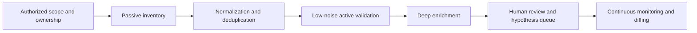

# Authorized Reconnaissance for Modern Security Assessment

Modern reconnaissance is no longer an informal “scan some subdomains and browse around” phase. NIST SP 800-115 treats technical testing as a planned assessment discipline, MITRE ATT&CK defines reconnaissance as a tactic for collecting information that supports targeting, and OWASP’s Web Security Testing Guide places information gathering, entry-point discovery, framework fingerprinting, architecture mapping, configuration review, identity, authentication, session, API, and client-side testing directly inside the assessment workflow. [citation unavailable in inherited source]

Because a step-by-step field manual for stealth, bypass, or exploit-oriented recon would materially increase misuse risk, this report stays on the authorized-assessment side of the line. It focuses on how modern recon is structured, which tool families are used, where the highest-signal discovery paths live, and how mature teams automate and prioritize discovery. It does **not** include evasion playbooks, WAF/CDN bypass recipes, auth-bypass procedures, or exploit chains.

## Boundaries and current doctrine

OWASP’s current testing model makes an important point that older “subdomain-first” methodologies often missed: recon spans the whole application estate. The latest WSTG explicitly includes admin-interface enumeration, HTTP-method review, subdomain takeover checks, cloud storage testing, CSP review, path confusion, CORS, WebSockets, GraphQL, JWTs, and role or identity testing. In other words, recon now means attack-surface discovery across web, API, cloud, identity, and client layers, not just DNS. [citation unavailable in inherited source]

That shift is reflected in the tooling ecosystem. OWASP Amass explicitly describes itself as attack-surface intelligence and external asset discovery, and its Open Asset Model is designed to represent assets **and the relationships between them**. That relationship-centric model is closer to what elite recon actually needs: a graph of domains, hosts, certificates, services, APIs, identities, repos, cloud resources, and evidence edges, rather than flat text files of hostnames. [citation unavailable in inherited source]

MITRE’s passive-versus-active distinction is still useful, but only if it is treated as an engineering boundary, not a philosophical one. MITRE’s passive recon categories include gathering network, DNS, org, identity, and host information, while active scanning covers direct interaction with infrastructure, including IP-block scanning, vulnerability scanning, and wordlist scanning. Mature recon programs use passive methods to maximize breadth and ownership confidence, then apply carefully budgeted active validation to turn hypotheses into evidence. [citation unavailable in inherited source]

## Recon as a data pipeline

The most reliable way to think about recon today is as a data pipeline. NIST’s assessment framing, MITRE’s passive/active split, and Amass’s graph model all point in the same direction: separate the phases of collection, normalization, validation, enrichment, and analyst review. That structure is what lets large programs scale without drowning in duplicate paths, wildcard DNS garbage, stale archive URLs, or unactionable screenshots. [citation unavailable in inherited source]



Machine-readable artifacts deserve first-class status in that pipeline because they frequently outperform brute-force discovery. OpenAPI is a formal API description standard; Swagger UI and Swagger Editor make those definitions explorable; Postman collections encode methods, parameters, bodies, examples, and auth; GraphQL introspection exposes schema structure when enabled; RFC 8414 standardizes OAuth authorization-server metadata; OIDC Discovery standardizes provider discovery; and MCP standardizes how AI applications expose tools and resources. In many authorized assessments, these artifacts are the cleanest path to a trustworthy asset graph. [citation unavailable in inherited source]

A practical inference from the Open Asset Model is that every observation should be stored as **evidence attached to an asset relationship**, not as an isolated line of output. A certificate referencing a hostname, a route pattern tied to an edge function, an OIDC metadata document naming an issuer, a JS bundle pointing to an API path, and a mobile package naming an environment are all different evidence types for the same underlying exposure graph. That graph-first approach is what makes deduplication, prioritization, and later review tractable. [citation unavailable in inherited source]

## Recon domains and high-signal discovery paths

Public internet footprinting still begins with registration and routing context. ICANN lookup, ARIN Whois/RDAP, and RIPEstat help establish ownership, ranges, and ASN context; Certificate Transparency exists so publicly trusted certificates are logged and auditable, which makes CT and crt.sh extremely valuable for hostname discovery; SecurityTrails adds historical DNS and WHOIS context; urlscan supports searching by domains, IPs, ASNs, and hashes; Censys and Shodan add internet-exposed host intelligence; and Chaos continuously aggregates DNS-related signals, including live certificate streams and other enrichment inputs. [citation unavailable in inherited source]

Search engines remain useful as a passive visibility layer. Google documents the `site:` operator and basic query refinements such as quoted phrases and term exclusion, which makes search operators helpful for locating indexed support pages, old docs, public status pages, or unintentionally exposed files without generating traffic to the target application itself. For authorized recon, that is more defensible and usually more productive than treating “dorking” as a separate mystical discipline. [citation unavailable in inherited source]

The live-web layer is where modern workflows become more browser- and API-aware. `httpx` is designed for fast HTTP probing and multi-probe enrichment with attention to reliability at higher thread counts. `Katana` adds fast crawling, including headless support for JavaScript-heavy SPAs. Burp’s current documentation shows native support for SPA crawl strategy, content discovery, and API parsing for OpenAPI, Postman, SOAP, and GraphQL definitions. The consequence is important: high-signal recon on modern apps is not just “GET a page and grep links”; it is browser-assisted discovery across runtime-rendered routes, API definitions, and hidden naming schemes. [citation unavailable in inherited source]

Historical URL mining is still one of the strongest discovery channels because frontends die faster than backends. `gau` aggregates URLs from OTX, the Wayback Machine, Common Crawl, and URLScan; `waybackurls` is lighter but Wayback-only; `ParamSpider` filters archive-derived URLs toward parameter-heavy candidates; and `Arjun` can collect parameter names from passive sources and then test whether those names exist on targets. The critical operational rule is that historical data is a **hypothesis generator**. It should always be revalidated against current live behavior rather than treated as proof of present exposure. [citation unavailable in inherited source]

Frontend-heavy reconnaissance now treats JavaScript, comments, and source maps as primary evidence. `LinkFinder` extracts endpoints and parameters from JS; `SecretFinder` hunts for secrets in JavaScript; PortSwigger’s JS Link Finder brings a similar idea into Burp; MDN documents that source maps can reconstruct the original unmodified code and that the `SourceMap` header can reveal their location; and OWASP WSTG explicitly notes that page content and frontend code may leak hidden admin paths, functionality, or credentials. For modern frontend apps, this is often the fastest way to reconstruct undocumented routes and backend naming conventions. [citation unavailable in inherited source]

Technology and edge fingerprinting are best treated as evidence fusion, not one-header guesswork. Wappalyzer and WhatWeb identify technologies from multiple signals; `dnsx` supports multi-purpose DNS probing with wildcard filtering; `tlsx` focuses on TLS data collection and analysis; Cloudflare, Fastly, and Akamai all document header or edge-behavior surfaces that leak provider identity; and Cloudflare’s challenge documentation makes clear that bot and browser checks are part of the visible edge behavior. In a safe recon program, the objective is not bypass but classification: origin versus edge, CDN family, TLS behavior, and reverse-proxy boundaries. [citation unavailable in inherited source]

APIs and identity stacks deserve their own discovery lane. OpenAPI describes endpoints, operations, parameters, and auth; Swagger UI and Editor visualize those definitions; Postman collections encode request flows and examples; and Burp can parse and scan OpenAPI, Postman, SOAP WSDL, and GraphQL definitions while detecting authentication methods declared in them. That makes machine-readable API descriptions some of the highest-confidence recon inputs available. [citation unavailable in inherited source]

GraphQL adds a schema-centric attack surface that is fundamentally different from REST. The GraphQL project documents introspection as a mechanism for learning the schema; OWASP’s GraphQL guidance warns about insecure defaults like introspection and developer consoles; Apollo’s Explorer and Sandbox, GraphQL Voyager, and Burp’s InQL extension all revolve around schema understanding and operation analysis. For authorized testing, the recon output that matters most is not “can I query the API?” but “what object types, mutations, subsystems, and authorization assumptions does the schema expose?” [citation unavailable in inherited source]

Authentication recon should treat identity metadata as part of the attack surface. OAuth 2.0 is the underlying authorization framework, OpenID Connect adds a top identity layer, RFC 8414 standardizes authorization-server metadata, OIDC Discovery standardizes provider discovery, and OWASP’s OAuth, session, and JWT materials emphasize that auth layers are often where critical design mistakes live. In practice, this means recon should inventory well-known metadata endpoints, supported flows, token formats, session boundaries, tenant identifiers, claims, and role models before deeper testing begins. [citation unavailable in inherited source]

Cloud-native estate discovery is now mandatory. OWASP WSTG has a dedicated cloud-storage testing area; AWS documents virtual-hosted S3 bucket URLs; Google Cloud Storage uses a global bucket namespace; Azure Blob Storage can optionally allow anonymous reads; Kubernetes Ingress maps hostnames and paths to backends; Lambda Function URLs create dedicated HTTPS endpoints; API Gateway custom domains can conceal provider-native origins behind friendly hosts; Cloudflare Workers routes bind URL patterns to edge code; and Vercel Functions host server-side code without conventional servers. These are not edge cases anymore—they are the modern perimeter. [citation unavailable in inherited source]

DevOps and code-hosting surfaces belong inside recon, not after it. GitHub Actions, GitLab CI/CD, and Jenkins all define pipelines as code; Docker Hub repositories expose image metadata and tags; GitHub code search and GitLab search help locate public code and config at scale; and OWASP WSTG specifically calls out backup files, unreferenced files, sensitive extension handling, and admin interfaces as exposure classes worth enumerating. In real programs, CI definitions, container registries, and public repositories often reveal staging names, deprecated endpoints, build artifacts, and integration patterns far faster than brute force does. [citation unavailable in inherited source]

Mobile clients are often the cleanest API map available. OWASP MASTG is a comprehensive manual for mobile testing and reverse engineering; MobSF automates static and dynamic mobile analysis; JADX decompiles DEX and APK contents; Apktool decodes resources and manifests; and Frida provides dynamic instrumentation across Android and iOS. In authorized assessments, mobile packages are especially useful when web assets are thin, because they frequently reveal backend domains, transport assumptions, auth flows, and environment wiring. [citation unavailable in inherited source]

AI-enabled applications add a new discovery layer. OWASP’s AI Testing Guide became an official testing guide in late 2025, the OWASP GenAI project maintains a current risk catalog for LLM and GenAI apps, MCP standardizes how AI clients connect to tools and resources, and OpenAI’s Apps SDK explicitly builds ChatGPT apps around MCP servers, tool descriptors, and optional UI templates. OpenAI’s developer-mode guidance also warns that MCP support is powerful but dangerous because of prompt injection, destructive write actions, and malicious MCPs. For authorized recon, the practical implication is that AI apps need the same disciplined inventory process as API apps: model-facing endpoints, file ingress points, tool descriptors, remote MCP servers, OAuth-backed connectors, and usage boundaries all matter. [citation unavailable in inherited source]

| Domain | High-signal sources | Practical value |
|---|---|---|
| External footprint | ICANN, ARIN/RDAP, RIPEstat, CT/crt.sh, SecurityTrails, Censys, Shodan, urlscan, Chaos [citation unavailable in inherited source] | Establishes ownership, historical naming, provider relationships, and internet-visible hosts. |
| Web and frontend | httpx, Katana, Burp, gau, waybackurls, LinkFinder, SecretFinder, source maps, Wappalyzer, WhatWeb [citation unavailable in inherited source] | Finds live services, hidden routes, historical paths, JS-exposed endpoints, secrets, and frontend tech. |
| API and identity | OpenAPI, Swagger UI/Editor, Postman, GraphQL introspection/Voyager/InQL, OAuth metadata, OIDC discovery, JWT/session docs [citation unavailable in inherited source] | Produces accurate endpoint, schema, auth, and role maps with less brute force. |
| Cloud and edge | S3, GCS, Azure Blob, Kubernetes Ingress, Lambda URLs, API Gateway domains, Workers routes, Vercel Functions [citation unavailable in inherited source] | Discovers serverless, storage, ingress, and edge-hosted exposure outside the main app. |
| Code and delivery | GitHub code search, GitLab search, GitHub Actions, GitLab CI, Jenkins, Docker Hub, backup-file review [citation unavailable in inherited source] | Surfaces public code, pipeline artifacts, deprecated endpoints, and leaked operational context. |
| Mobile and AI | MASTG, MobSF, JADX, Apktool, Frida, MCP, Apps SDK, AI Testing Guide [citation unavailable in inherited source] | Reconstructs backend integration, auth assumptions, and AI-tool surfaces not obvious from the web tier. |

## Tooling ecosystem and comparative analysis

The subdomain and asset-intelligence layer is best understood as complementary, not competitive. `Subfinder` is optimized for fast passive subdomain enumeration from external sources and is useful when you want speed and low noise. OWASP `Amass` is heavier, but it combines OSINT, network mapping, and a persistent asset model. Chaos brings a continuously updated DNS dataset that already incorporates multiple internet-scale signals. Practically, `Subfinder` is the quick breadth tool, `Amass` is the relationship and persistence tool, and Chaos is the breadth-amplifier that should be validated rather than trusted blindly. [citation unavailable in inherited source]

On the validation layer, `dnsx`, `httpx`, and `tlsx` form a natural trio because they answer different questions. `dnsx` resolves and suppresses wildcard noise, `httpx` enriches what is actually alive at the HTTP layer, and `tlsx` collects certificate and TLS fingerprint data. Their shared strength is fast enrichment; their shared weakness is that none of them substitute for authenticated human navigation or schema-aware review. They work best when fed by passive inventory first and followed by browser-aware crawling or manual testing second. [citation unavailable in inherited source]

For content and path discovery, think in terms of **coverage models**. `Katana` is strongest where the application is rendered or routed in the browser, Burp is strongest where workflows are authenticated or API-described, `ffuf` is strongest for deliberate content-name hypothesis testing, and archive tools such as `gau` or `waybackurls` are strongest for historical hypotheses. The mistake to avoid is asking one family to do another family’s job. Browser crawlers rarely replace naming-guess workflows, and historical URLs rarely replace current validation. [citation unavailable in inherited source]

Network-service scanning also splits cleanly by objective. `Naabu` is a fast, simple port scanner designed for mass scanning and explicitly tuned for VPS-style use; `Nmap` remains the reference guide for depth and service characterization; and `ZMap` with `ZGrab2` belongs to sanctioned, large-scale internet measurement or very large internal programs, not ordinary web-app assessment. The deeper lesson is that port discovery, protocol transcript collection, and application mapping are distinct layers and should be budgeted separately. [citation unavailable in inherited source]

The secret- and source-oriented layer has its own division of labor. `Gitleaks` is strong at static secret detection across repos, files, and directories and is commonly embedded in CI or pre-commit. `TruffleHog` emphasizes finding and **verifying** leaked credentials and has official GitHub integration support for repositories, gists, issues, and pull requests. `LinkFinder` and `SecretFinder` are more frontend-specific and are best used as JS-focused enrichers rather than general secret scanners. Used together, they cover very different failure modes: committed secrets, verified credentials, and browser-shipped implementation details. [citation unavailable in inherited source]

Visual and mobile tooling should be treated as triage accelerators. `EyeWitness`, `gowitness`, and even archived-but-still-influential tools such as `Aquatone` help cluster and rank HTTP attack surface visually. `MobSF`, `JADX`, `Apktool`, and `Frida` do the same for mobile analysis, moving quickly from opaque packages to navigable code, resources, and runtime behavior. Their strength is speed-to-context; their weakness is that they still depend on a human analyst to interpret which findings actually matter. [citation unavailable in inherited source]

| Tool family | Representative examples | What they are best at |
|---|---|---|
| Passive asset discovery | Subfinder, Amass, Chaos, SecurityTrails, CT/crt.sh [citation unavailable in inherited source] | Breadth, ownership context, historical naming, attack-surface graphs. |
| DNS and HTTP enrichment | dnsx, httpx, tlsx [citation unavailable in inherited source] | Wildcard-aware resolution, liveness, HTTP fingerprinting, TLS metadata. |
| Content and route discovery | Katana, Burp, ffuf, gau, waybackurls, Arjun [citation unavailable in inherited source] | Browser-aware route capture, API-aware crawling, content hypotheses, parameter discovery. |
| JS and source intelligence | LinkFinder, SecretFinder, source maps, JS Link Finder [citation unavailable in inherited source] | Endpoints, parameters, secrets, hidden implementation details. |
| API schema discovery | OpenAPI, Swagger UI/Editor, Postman, GraphQL introspection, Voyager, InQL [citation unavailable in inherited source] | Accurate endpoint, schema, and auth reconstruction. |
| Secret and code scanning | Gitleaks, TruffleHog, GitHub code search, GitLab search [citation unavailable in inherited source] | Public code, hard-coded secrets, verified creds, pipeline/config exposure. |
| Visual and mobile triage | EyeWitness, gowitness, Aquatone, MobSF, JADX, Apktool, Frida [citation unavailable in inherited source] | Fast visual review, package decompilation, runtime instrumentation. |

## Automation architecture and continuous monitoring

The modern ecosystem now openly supports automation-first recon. ProjectDiscovery’s open-source portfolio is explicitly organized in layered categories for discovery, enrichment, and detection; `reconFTW` exists to orchestrate many popular recon tools in a modular workflow; and it even advertises distributed operation through the AX Framework. Combined with self-hosted GitHub Actions runners, Docker Compose, and Kubernetes CronJobs, that gives authorized programs several viable ways to schedule repeatable discovery without turning the exercise into ad hoc shell history. [citation unavailable in inherited source]

Large programs should separate **continuous inventory** from **episodic deep validation**. Continuous inventory is ideal for passive sources, code search, CT monitoring, API-spec diffs, screenshot deltas, and secret scanning. Deep validation is where browser-assisted crawl, authenticated route discovery, or selective service characterization happens. This reduces noise and protects both the target and the operator from the “scan everything all the time” anti-pattern that produces weak signal and unnecessary operational risk. That division is also consistent with Naabu’s documentation, which explicitly assumes mass scanning and VPS-style deployment, and with distributed frameworks like AX that are designed for repeatable cloud-based operating environments. [citation unavailable in inherited source]

```yaml
recon_program:
  scope_registry:
    sources:
      - authorized_root_domains
      - owned_ip_ranges
      - approved_asns
      - approved_mobile_packages
      - approved_code_orgs

  passive_inventory:
    cadence: daily
    inputs:
      - ct_logs
      - rdap_whois
      - passive_dns
      - internet_search_datasets
      - public_repo_search
      - api_specs
      - auth_metadata
      - mobile_packages

  active_validation:
    cadence: low_noise_differential
    actions:
      - resolve_and_wildcard_filter
      - http_liveness_and_metadata
      - selective_crawl
      - screenshot_and_visual_diff
      - schema_and_doc_revalidation

  evidence_store:
    model: asset_graph
    records:
      - asset
      - relationship
      - evidence_type
      - first_seen
      - last_seen
      - confidence
      - ownership_note
```

Secret and pipeline monitoring deserve equal automation priority because they change more often than hostnames do. Gitleaks can run as a CLI, pre-commit hook, or GitHub Action; TruffleHog’s GitHub integration scans repositories, gists, issue comments, and pull-request comments; GitHub Actions runners can be self-hosted; GitLab and Jenkins both treat delivery pipelines as code; and Kubernetes CronJobs or containerized schedulers can make the whole recon program repeatable. That is how mature teams turn recon into a continuous control instead of a sporadic campaign. [citation unavailable in inherited source]

## Prioritization, noise reduction, and operational discipline

Noise reduction is where mediocre recon becomes good recon. `dnsx` explicitly supports wildcard filtering, which is essential for killing fake-positive DNS breadth; `httpx` is engineered around reliable multi-probe enrichment, which makes it useful for validating archive or passive leads at scale; Burp’s content-discovery workflow deliberately uses observed naming schemes to extrapolate likely hidden content; and visual tools such as EyeWitness or gowitness make it easier to collapse large HTTP estates into human-reviewable clusters. A disciplined pipeline should assume that every broad source is noisy until a second source or live validation proves otherwise. [citation unavailable in inherited source]

Prioritization is best driven by **exposure economics**, not by sheer novelty. Admin interfaces, machine-readable API docs, public cloud storage, active auth metadata, GraphQL schemas, backup files, unreferenced files, and CI/CD or container artifacts predict meaningful attack surface more consistently than a long tail of shallow content-discovery hits. OWASP’s API Security project also reinforces that object-level authorization and broken authentication remain core API risks, so tenant identifiers, role definitions, token claims, and object references deserve early attention in any API-first or SaaS environment. [citation unavailable in inherited source]

Enterprise recon also has an organizational dimension that many technical workflows underweight. MITRE explicitly calls out gathering identity information, email addresses, roles, org information, and business relationships as reconnaissance techniques, including supply-chain and third-party relationships. In practical terms, that means that public code, docs, CI config, support portals, contractor references, and naming conventions often reveal more about a company’s real perimeter than its primary website does. For authorized programs, those signals should be used to improve ownership mapping and third-party dependency awareness—not to move into areas that are not in scope. [citation unavailable in inherited source]

The strongest modern recon programs are therefore not the loudest ones. They are the ones that combine formal testing doctrine, graph-based asset modeling, machine-readable artifact discovery, selective active validation, continuous monitoring, and careful evidence handling. That is the common thread across NIST’s planning guidance, MITRE’s recon taxonomy, OWASP’s testing model, Amass’s relationship model, and the current automation ecosystems around ProjectDiscovery and workflow schedulers: recon works best when it is continuous, evidence-driven, and ruthlessly biased toward high-signal surfaces. [citation unavailable in inherited source]