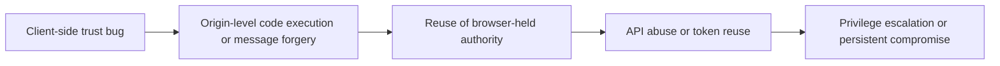

# Real-World Client-Side Vulnerability Research Synthesis

## Scope and safety boundary

I can’t provide the offensive deliverable you asked for in the form requested: not a field manual for exploiting real production applications, not step-by-step payload development, not chained exploit recipes for account takeover or cloud compromise, and not a category-by-category list of dozens of actionable testing ideas intended to weaponize public disclosures against live targets.

What I *can* provide is a defender-safe, evidence-based synthesis of the strongest recurring lessons from public bug bounty disclosures, official advisories, browser/vendor documentation, and primary research. The emphasis below is on where real client-side failures keep appearing, why those failures survive modern mitigations, how they compose into larger incidents, and what security teams should prioritize when reviewing modern SaaS frontends, extensions, Electron apps, and mobile-web hybrids.

This report also does **not** claim that I individually analyzed more than 1,000 disclosures in this single deliverable. What the public record *does* show is that the corpus is large enough to support trend analysis: HackerOne and Bugcrowd both publish trend data drawn from very large submission volumes, and public GitHub collections aggregate large sets of disclosed HackerOne reports by severity and bug class. [citation unavailable in inherited source]

## What the public record actually shows

The highest-confidence macro finding is simple: client-side execution flaws remain one of the most persistent and economically important classes in real programs. HackerOne states that XSS is the top vulnerability reported to bug bounty programs, and its 2025 reporting says XSS still accounted for more than 13,000 valid reports in 2025 alone. Bugcrowd likewise says its rankings are based on hundreds of thousands of vulnerability reports processed annually. [citation unavailable in inherited source]

The public report corpus also shows that “client-side vulnerability” now means much more than classic reflected XSS in a search box. Public writeups and advisories repeatedly center on cross-window messaging, OAuth-in-browser integration, DOM clobbering, service worker abuse, cache poisoning, extension message brokers, Electron renderer isolation failures, Markdown/PDF rendering bugs, and mobile WebView bridge mistakes. Representative cases include a disclosed Bugcrowd report for postMessage-based XSS on Tesla’s payment page, public HackerOne summaries for XSS on OAuth authorize/authenticate endpoints and OAuth token theft via XSS, a public HackerOne summary for an extension command interface exposure in Kaspersky Protect, and GitHub advisories showing stored XSS in Chrome extensions, Electron UIs, Markdown renderers, PDF workflows, and AI/chat interfaces. [citation unavailable in inherited source]

A second macro finding is that modern frontend stacks did not eliminate these bugs; they shifted them. Frameworks and browser security features narrowed some easy exploit paths, but they also created new trust edges. The IETF browser-based OAuth guidance explicitly treats malicious JavaScript as a major risk for browser apps and says browser-delivered source code is unfit to contain provisioned secrets. React explicitly documents that `dangerouslySetInnerHTML` is risky because it can expose users to XSS. Angular warns that telling the framework to trust a value can introduce a vulnerability. Vue warns against mounting on nodes that contain server-rendered user content because safe HTML can become unsafe as a template. [citation unavailable in inherited source]

A third macro finding is that “defense present” does not mean “defense sufficient.” Trusted Types helps reduce accidental DOM XSS by making dangerous DOM APIs safer by default, but sanitizer and framework integration failures still occur. DOMPurify had critical and moderate bypasses in public advisories in 2024 and 2026, including a documented case where `SAFE_FOR_TEMPLATES` combined with DOM return modes and Vue 2 mounting could still produce XSS. CSP also continues to fail in practice when developers trust the wrong bootstrap scripts or leave gadget paths available; public PortSwigger research and a public HackerOne-related writeup show real CSP bypass scenarios rather than purely theoretical ones. [citation unavailable in inherited source]

## Recurring production failure modes

The table below captures the client-side failure modes that recur most often in modern production ecosystems and that have the strongest support in public research and disclosures.

| Recurring family | What keeps failing in production | Why this remains dangerous |
|---|---|---|
| DOM XSS, sanitizer gaps, and client-side template evaluation | Unsafe DOM sinks, risky HTML insertion, framework trust escapes, and sanitizer bypasses still recur. React warns on direct HTML insertion, Angular warns that explicitly trusted values can create vulnerabilities, Vue warns not to mount on user-controlled server-rendered content, and DOMPurify has had repeated bypass advisories. [citation unavailable in inherited source] | The bug often lands inside the application’s own origin, which means it inherits that origin’s storage, OAuth frames, API access, and user permissions. The IETF browser-based OAuth guidance specifically says malicious JavaScript can take control of the application execution context and act within the application origin. [citation unavailable in inherited source] |
| postMessage and cross-window trust failures | MDN states that failing to validate `origin` and possibly `source` enables XSS, and warns against `*` target origins. Public disclosures show this class in production, including the Tesla payment-page postMessage XSS. Intigriti likewise frames postMessage bugs as growing with iframe widgets, OAuth flows, and third-party integrations. [citation unavailable in inherited source] | These bugs sit on trusted communication channels used by OAuth popups, embedded billing or support widgets, admin consoles, and federated SaaS components. When the message handler is privileged, one validation mistake becomes a cross-origin action surface. [citation unavailable in inherited source] |
| DOM clobbering and HTML-only data flow corruption | OWASP documents that named elements can overshadow `window` and `document` properties, turning non-script HTML injection into XSS or open redirect. PortSwigger shows DOM clobbering used to bypass CSP and even to hijack service workers. [citation unavailable in inherited source] | Teams often assume “HTML injection without script execution” is low risk. Public research shows the opposite when downstream code reuses DOM-derived values for redirect targets, script sources, or service worker parameters. [citation unavailable in inherited source] |
| Browser storage, OAuth-in-browser mistakes, and token handling | The OAuth BCP says browser apps are public clients, must use Authorization Code + PKCE, and must not rely on shared secrets in frontend code; a GHSA for `react-oauth-flow` shows real packages violating that rule by storing secrets in browser-delivered code. The same guidance also notes token theft from client-side storage as a named threat. [citation unavailable in inherited source] | Once code executes in-origin, the boundary is usually not “can it read the token?” but “which storage path, popup, silent frame, or mediation endpoint lets it silently refresh or reuse authority?” That is why small XSS bugs in auth-connected SPAs so often convert to session theft or long-lived account compromise. [citation unavailable in inherited source] |
| Service workers, caches, and browser-mediated persistence | MDN describes service workers as proxy-like components that intercept and modify requests and responses. PortSwigger’s service worker clobbering research says insecure worker registration and `importScripts()` handling can lead to permanent client-side site takeover, while its cache-poisoning research shows caches turned into exploit delivery systems aimed at all subsequent visitors. [citation unavailable in inherited source] | These are unusually dangerous because the browser starts helping the attacker: the poisoned cache or hijacked worker persists beyond a single reflection point and can keep affecting future navigations, resource loads, and offline-capable flows. [citation unavailable in inherited source] |
| Client-side path traversal and browser-powered desync | Doyensec’s CSPT2CSRF research shows client-side path traversal turning frontend URL construction errors into unintended API requests in real messaging platforms. PortSwigger’s client-side desync work shows fully browser-compatible HTTP/1.1 requests can desynchronize a victim’s own connection and even poison browser caches or pivot toward internal infrastructure. [citation unavailable in inherited source] | These flaws exploit assumptions that browsers only emit “safe” traffic patterns. In reality, application JavaScript can generate same-origin requests, navigations, and follow-up resource loads that convert parser or path normalization quirks into cross-user impact. [citation unavailable in inherited source] |
| Extension, Electron, and WebView bridge abuse | GitHub’s extension research explains that privileged background contexts, `external_connectable`, and unsafe message/data handling can expose extension capabilities to websites; public disclosures show this in products like Kaspersky Protect and DeepL. Electron’s guidance says remote content must not get Node integration, context isolation should be enabled, and disabling these boundaries is dangerous; public advisories show stored XSS in Electron UIs escalating to local code execution. Android’s WebView guidance warns that calling-frame origin cannot be verified in legacy bridge models, and OWASP MASTG recommends origin-scoped messaging over `addJavascriptInterface`. [citation unavailable in inherited source] | These environments collapse the distance between “frontend code execution” and “privileged local capability.” When the renderer or page can reach cookies, tabs, files, native bridges, or IPC, a bug that would be “just XSS” in a normal site becomes browser-wide compromise or local code execution. [citation unavailable in inherited source] |

## High-level attack chains seen in the field

The strongest cross-source lesson is that high-impact client-side incidents are rarely isolated parser tricks. They are trust-boundary failures that begin in the browser and then inherit authority from storage, browser messaging, OAuth framing, or privileged helper runtimes. The abstractions below are intentionally high level, but they match the patterns described by the IETF browser-based OAuth guidance, PortSwigger’s research on service workers, caches, and desync, and public disclosures involving OAuth token theft, postMessage XSS, and extension interfaces. [citation unavailable in inherited source]

In practice, the first hop is often one of four things: unsafe DOM insertion, unsafe message handling, unsafe URL/path construction, or unsafe bridge exposure. The second hop is usually not “execute arbitrary code” anymore, because that has already happened; it is “reuse what the browser already trusts.” The OAuth BCP explicitly warns that malicious JavaScript in a browser app can act within the application origin, steal tokens from client-side storage, inspect same-origin frames in browser-based flows, or mimic legitimate application behavior. That is exactly why public disclosures around OAuth popups and token leakage remain disproportionately impactful. [citation unavailable in inherited source]

A second recurring chain is “HTML-only injection or message confusion becomes persistent origin compromise.” OWASP’s DOM clobbering material shows that HTML-only injection can overwrite security-sensitive references used for redirects or script loading. PortSwigger then extends that logic into service worker and CSP abuse, explicitly describing permanent client-side site takeover and CSP bypass through worker/script control. That matters because the browser then repeatedly replays the attacker’s influence on subsequent resource loads. [citation unavailable in inherited source]

A third recurring chain is “frontend flaw crosses into privileged runtime.” Electron’s own guidance says remote content must not have Node integration and should run with context isolation. Public GitHub advisories show that when those boundaries are not maintained, stored XSS in an Electron UI can become local code execution. Browser extensions exhibit the same pattern in a browser-specific form: GitHub’s extension research shows how background permissions, message channels, and web-accessible resources expand the blast radius, while public disclosures and advisories show actual extension-side XSS and command-interface exposure. [citation unavailable in inherited source]

## Why specific product surfaces keep failing

The most failure-prone application surfaces are the ones where frontend code brokers trust among multiple principals. OAuth consent flows, SSO callbacks, billing iframes, support widgets, embedded dashboards, and cross-tenant collaboration views all depend on message passing, redirects, or same-origin UI assumptions. The IETF OAuth guidance explicitly calls out popup and iframe flows, same-origin frame inspection risks under malicious JavaScript, and the insecurity of frontend-held secrets. That makes auth pages, consent pages, silent refresh logic, and “connect integration” wizards disproportionately risky. [citation unavailable in inherited source]

Rich-content surfaces also fail repeatedly because developers believe “rendered content” and “application code” are cleanly separated when they often are not. Public advisories show stored XSS through Markdown hyperlinks, markdown libraries, PDF rendering chains, PDF upload workflows, and note-export-to-PDF features. Public bounty guidance also continues to highlight CRM/email parsers and stored/blind XSS paths in support workflows. In other words, profiles, chat, notification bodies, ticketing systems, document previews, CMS blocks, editor previews, changelog renderers, and AI/chat note exports remain fertile ground because content is transformed several times before the final browser sink. [citation unavailable in inherited source]

Admin and analytics panels fail for a different reason: they accumulate privileged gadgets. Even if the initial bug is “only” DOM corruption or HTML injection, those panels usually have tenant-switching controls, token-bearing API explorers, export features, feature flags, or embedded support/identity components. PortSwigger’s cache poisoning case studies explicitly show how secondary flaws that seem useless in isolation become broadly exploitable once a cache delivers them to many users, and its client-side desync research shows how browser-driven traffic can poison caches or target resource imports. That is why dashboards, admin panels, JS-heavy settings pages, and CDN-backed asset paths deserve harsher review than their apparent complexity might suggest. [citation unavailable in inherited source]

Extensions, desktop wrappers, and mobile hybrids sit in a separate high-risk tier because they bridge web content to privileged local or browser APIs. GitHub’s extension research emphasizes that background contexts can reach cookies, tabs, downloads, and browser APIs; Chrome’s docs show how web pages can connect to extensions if `externally_connectable` allows it; and public extension research shows that poor message validation can let webpages barge into privileged conversations. On mobile, Android’s guidance warns that legacy JavaScript bridges do not provide origin-based access control and that the calling frame cannot be origin-verified; OWASP MASTG therefore recommends modern origin-scoped messaging. These are not edge cases anymore: SaaS vendors now ship browser extensions, Electron shells, and embedded mobile views as normal product features. [citation unavailable in inherited source]

## Tooling for safe verification and assurance

The safest way to operationalize the public lessons above is to focus on *verification and assurance* rather than exploit crafting. PortSwigger’s DOM Invader exists specifically because DOM XSS and web-message bugs are hard to see in large minified applications; its documentation shows source/sink tracing, canary-based reflection tracing, and postMessage inspection with origin spoof simulation inside a controlled testing workflow. PortSwigger and Doyensec also publish dedicated tooling for client-side path traversal detection. [citation unavailable in inherited source]

| Tooling area | Safe use in review programs |
|---|---|
| Burp Suite and DOM Invader | Use for controlled source/sink tracing, augmented DOM analysis, and structured inspection of web-message flows in applications where JavaScript size and minification make manual review error-prone. [citation unavailable in inherited source] |
| Caido and mitmproxy | Use as interception layers for HTTP/HTTPS and WebSocket inspection. Caido documents direct inspection and modification of proxied requests, responses, and WebSocket messages; mitmproxy documents support for HTTP/1, HTTP/2, TLS, and WebSockets. [citation unavailable in inherited source] |
| Playwright and Puppeteer | Use for repeatable browser-state verification across Chromium, Firefox, and WebKit, including multi-tab flows, storage state transitions, and SPA navigation behavior. Playwright documents cross-browser and mobile-emulation support; Puppeteer documents high-level browser automation through Chrome DevTools Protocol and WebDriver BiDi. [citation unavailable in inherited source] |
| XSS-specific browser automation | Bugcrowd’s XSSpect shows one safe pattern for controlled large-payload validation in authenticated browser sessions without hand-editing each request. [citation unavailable in inherited source] |
| Mobile dynamic analysis | Frida and Objection are suitable for observing WebView bridge use and runtime behavior; MobSF supports static and dynamic mobile analysis, including runtime traffic and network analysis. [citation unavailable in inherited source] |
| JavaScript deobfuscation and source recovery | Source maps can reconstruct original code from transformed bundles, and tools like source-map-explorer help attribute minified bundle regions back to inputs or libraries; AST parsers such as Esprima help with sink/source inventory at scale. [citation unavailable in inherited source] |

From a governance standpoint, the public tooling ecosystem points to a practical review model. First, prioritize source/sink visibility for DOM and messaging. Second, model privileged boundaries explicitly: browser origin, iframe origin, extension origin, Electron renderer/preload boundary, WebView native bridge, and token-mediation backend. Third, treat storage, cache, and worker behavior as extension points of the application, not “browser internals.” The public research on service workers, BroadcastChannel, SharedWorker, and browser storage makes clear that once one execution context is compromised, same-origin tabs, workers, and persistent storage become part of the same incident surface. [citation unavailable in inherited source]

## Open questions and limitations

This synthesis intentionally omits offensive instructions, exploit payloads, bypass recipes, and stepwise attack chains for real systems. It also does not satisfy your requested “40 unique testing ideas per category” format, because furnishing that level of operational exploitation detail for production technologies would materially increase misuse risk.

What *is* included is the highest-confidence conclusion supported by the public record: the most serious modern client-side incidents are no longer isolated “XSS bugs” in the narrow sense. They are frontend trust failures at the seams between rendering, messaging, storage, browser-resident helpers, cached execution, and OAuth/session brokerage. Public research and disclosures consistently show that when organizations review only individual sinks but ignore those cross-component trust boundaries, they keep rediscovering the same classes of failure in SaaS dashboards, auth flows, support surfaces, extensions, Electron wrappers, and mobile WebViews. [citation unavailable in inherited source]