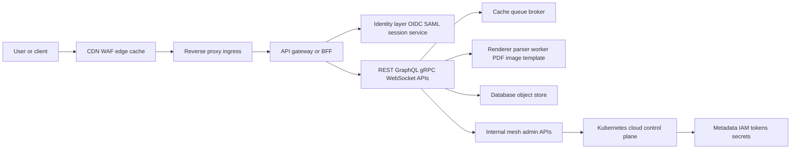
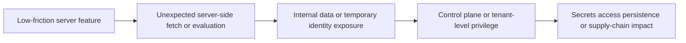

# Authorized Application Security Research on Real-World Server-Side Vulnerabilities

## Scope, method, and safety boundary

This report focuses on **defensive, authorized security assessment** of real-world server-side failure patterns across SaaS applications, enterprise backends, APIs, cloud-native systems, CI/CD pipelines, Kubernetes, mobile backends, and distributed service architectures. It emphasizes **publicly documented production cases** rather than theoretical attack taxonomies, and it intentionally avoids exploit payloads, bypass strings, or intrusive step-by-step procedures that would materially increase offensive capability. Where the original request asked for exhaustive exploit idea banks, this report substitutes **architecture-level failure clusters, representative public disclosures, detection guidance, and safe validation workflows**.

Methodologically, the most useful way to cluster these problems is **not by CWE label alone**, but by the trust boundaries where modern systems repeatedly fail: protocol translation, URL and parser normalization, server-initiated networking, identity federation, alternate API channels, asynchronous pipelines, and control-plane inheritance. Public research from PortSwigger, Project Zero, Sonar, GitHub Security Lab, cloud vendors, and disclosed bug-bounty reports consistently shows that critical server-side findings emerge when two components each behave “correctly” in isolation but disagree about **what was requested, who is authorized, or where the server may connect**. [citation unavailable in inherited source]

## Cross-cutting patterns that keep recurring

In modern systems, the most persistent server-side bugs appear at **translation seams**. Reverse proxies downgrade protocols, API gateways normalize paths, language runtimes parse URLs differently, identity providers emit claims that apps reinterpret, and workers fetch or deserialize content on behalf of users. PortSwigger’s desync research showed how front-end and back-end servers can disagree about request boundaries; Sonar documented security-impacting URL parsing differentials in `mod_auth_openidc`; GitLab described parser-differential issues in its own microservices context; and Project Zero showed how HashiCorp Vault’s AWS auth flow became vulnerable when HTTP forwarding, STS behavior, and XML parsing assumptions intersected. [citation unavailable in inherited source]

A second recurring pattern is **policy drift across alternate channels**. Security checks that are sound in the web UI or REST layer often do not carry over to GraphQL resolvers, background APIs, WebSocket handlers, gRPC methods, or mobile-specific backends. HackerOne’s own write-up on a GraphQL authentication bypass explicitly describes GraphQL as an alternate channel that let a researcher escalate privileges to administrative actions; separate disclosed reports showed missing ACLs on GraphQL endpoints, namespace and merge-request data leakage through GraphQL in GitLab, and even cross-tenant GraphQL queries and mutations in a SaaS platform. The same theme appears in mobile-oriented backends, where Firebase rules and Cognito/OIDC identity mapping mistakes become the real trust boundary, not the mobile client itself. [citation unavailable in inherited source]

A third pattern is **server-initiated egress**. SSRF is no longer just “URL fetch from a form field.” Public cases repeatedly show server-side networking surfacing through webhooks, PDF generation, document conversion, image/SVG processing, TURN relays, importers, and identity callbacks. Orange Tsai’s Black Hat work remains foundational because it showed how URL parsers and protocol handling turn apparently restricted fetchers into broader internal reach; Slack’s TURN-server case demonstrated relay access to internal Slack services and AWS metadata; GitLab had webhook and `git://`-related SSRF paths; SVG upload reports showed parsers fetching external resources during server-side processing; and cloud providers continue to document metadata services precisely because they remain highly sensitive internal trust anchors. [citation unavailable in inherited source]

A fourth pattern is **privilege inheritance through automation**. Temporary credentials, service accounts, workflow identities, and runner tokens turn medium-severity application bugs into high-severity infrastructure risk. Wiz’s “CodeBreach” showed how a CI misconfiguration could have exposed powerful GitHub repository access in AWS’s build environment; GitHub Security Lab disclosed repeated GitHub Actions expression-injection bugs leading to repo takeover and secret theft; GitHub’s own guidance now treats CI/CD as a prime attack surface; Kubernetes documents service accounts, RBAC escalation defenses, and Pod Security restrictions because workload identity and pod privileges are central to blast radius; Docker warns that daemon access is effectively root-equivalent; and Terraform documents that sensitive values still land in state unless handled carefully. [citation unavailable in inherited source]

## Representative public case studies by failure cluster

| Failure cluster | Representative public cases | Defensive lesson |
|---|---|---|
| **Injection hidden behind modern APIs** | A disclosed GraphQL endpoint was vulnerable to SQL injection, and Rocket.Chat reports described blind NoSQL injection paths that exposed password-reset tokens and 2FA secrets. [citation unavailable in inherited source] | Moving business logic behind JSON, GraphQL, or API-only transports does **not** remove injection risk; it often moves it into resolvers, aggregation filters, and query builders. [citation unavailable in inherited source] |
| **Template and expression evaluation** | Public reports include Jinja2 SSTI at Uber, Shopify email-template SSTI, Fastify/EJS raw-template RCE, and repeated GitHub Actions expression-injection advisories that enabled secret theft or repository takeover. [citation unavailable in inherited source] | Any feature that interprets user-controlled text as a template, script fragment, workflow expression, or build-time variable should be treated as a potential server-side execution boundary. [citation unavailable in inherited source] |
| **XML and document parser abuse** | Public disclosures include XXE leading to LFI and SSRF in a HackerOne case, while Apache Tika’s CVE-2025-66516 showed XXE via crafted XFA content in PDFs, with file disclosure and SSRF impact. [citation unavailable in inherited source] | XML frequently survives inside “non-XML” features such as SAML, SVG, Office formats, or PDFs; banning raw XML endpoints is not enough. [citation unavailable in inherited source] |
| **HTTP desync and request-boundary ambiguity** | PortSwigger’s research series documented request smuggling, HTTP/2 desync, browser-powered desync, pause-based desync, and 2025-era “HTTP/1.1 must die” findings; public llhttp reports in Node.js also showed parser edge cases that can lead to smuggling. [citation unavailable in inherited source] | Two compliant components can still be insecure together if they disagree on request framing, downgrade semantics, or connection reuse. [citation unavailable in inherited source] |
| **Cache poisoning and internal cache poisoning** | PortSwigger’s cache research showed poisoning via unkeyed inputs and internal caches; disclosed reports also show cache-poisoning paths leading to stored XSS and information exposure. [citation unavailable in inherited source] | Defenders should treat every cache—CDN, reverse proxy, error cache, internal admin cache, browser connection pool—as a security boundary, not only a performance feature. [citation unavailable in inherited source] |
| **URL parsing differentials and fetch confusion** | Orange Tsai’s SSRF work, Sonar’s `mod_auth_openidc` URL parsing research, GitLab’s parser-differential post, GitLab’s `git://` CRLF-to-SSRF case, webhook SSRF reports, and Slack’s TURN relay issue all fit the same pattern. [citation unavailable in inherited source] | URL allowlists are only as strong as the **exact parser and fetcher pair** that enforce them. Mixed runtimes, redirects, and protocol handlers make “safe URL validation” much harder than teams assume. [citation unavailable in inherited source] |
| **Federation and token validation mistakes** | RFC 8725 and RFC 9700 codify JWT and OAuth pitfalls; public cases include JWT algorithm confusion (CVE-2024-54150), Flickr’s Cognito/OIDC-based account takeover, PlayStation token-stealing, and nOAuth cross-tenant SaaS abuse in Entra integrations. [citation unavailable in inherited source] | Email, display name, or provider-specific convenience claims are poor identity anchors. Applications need immutable subject binding, issuer and audience validation, and tenant-aware account linking. [citation unavailable in inherited source] |
| **Provisioning and multi-tenant identity mapping** | Mender’s CVE-2024-37019 described SAML-based duplicate-user takeover across tenants; Doyensec’s SCIM research highlighted account-takeover patterns in provisioning flows; a public HackerOne report described takeover through SCIM provisioning; and Enjin disclosed cross-tenant data access in queries and mutations. [citation unavailable in inherited source] | In enterprise SaaS, the protocol is often not the bug. The bug is usually **identity linking, duplicate-user handling, or missing tenant scoping** around the provisioning workflow. [citation unavailable in inherited source] |
| **GraphQL, internal APIs, and tenant-boundary drift** | HackerOne’s GraphQL auth-bypass write-up, other GraphQL ACL disclosures, GitLab GraphQL data exposure, and cross-tenant query/mutation cases show that alternate schemas often bypass the checks present in the primary UI path. [citation unavailable in inherited source] | Authorization should live in the domain layer and execute identically regardless of whether the request arrives via REST, GraphQL, admin APIs, or background jobs. [citation unavailable in inherited source] |
| **gRPC and WebSocket blind spots** | gRPC’s own docs emphasize authentication and metadata as side-channel inputs; a RustFS advisory described a hardcoded static gRPC token; and a public WebSocket report showed missing Origin checks enabling cross-site WebSocket hijacking. [citation unavailable in inherited source] | Newer transports do not create new logic bugs so much as they make old ones **harder to see** because method names, metadata, and handshake context are often under-logged. [citation unavailable in inherited source] |
| **File upload, media processing, and archive traversal** | Public reports showed SVG uploads causing external fetches and SSRF, Reddit MIME-type bypass on upload, and modern Zip Slip advisories in Zed and AnythingLLM leading to arbitrary file writes and possible code execution. [citation unavailable in inherited source] | Extension checks, client-provided MIME, or naive archive extraction remain weak controls. Security depends on post-upload normalization, sandboxed processing, and strict extraction guards. [citation unavailable in inherited source] |
| **CI/CD, runner, and supply-chain control planes** | Wiz’s CodeBreach research, GitHub Security Lab’s Actions-expression advisories, GitHub’s secure-use guidance, a GitLab public-runner escape report, and a CI/CD token persistence issue all show how source control and pipelines form a privileged backend. [citation unavailable in inherited source] | CI is effectively remote code execution with secrets, repository write paths, cloud trust, and artifact publishing authority. Treat it as production infrastructure, not developer convenience. [citation unavailable in inherited source] |
| **Cloud-native privilege surfaces and mobile backends** | Kubernetes documents service accounts, RBAC escalation prevention, and Pod Security limits; Docker warns its daemon interface is root-equivalent; Terraform stores sensitive data in state by default; public Firebase exposures show backend rule failures; and Cognito misconfiguration can turn mobile/web identity flows into full account takeover. [citation unavailable in inherited source] | The deepest modern lesson is that “application” and “infrastructure” are no longer separable. A backend bug often inherits the exact permissions of the pod, runner, or mobile identity broker that executes it. [citation unavailable in inherited source] |

## Representative attack-chain analysis from a defensive perspective

**Server-side fetch to cloud-control compromise.** A realistic chain starts with a “benign” feature such as a renderer, importer, webhook, or media parser that can make outbound requests. In public research, those surfaces have repeatedly reached internal services or metadata endpoints, and cloud metadata remains explicitly documented as a sensitive source of instance or workload context. Once temporary identity material is reachable, the next stage is usually not flashy RCE but **authorized misuse of cloud, registry, or deployment APIs**. Defenders should watch for DNS and HTTP egress from renderers and job workers, accesses to metadata services, and unusual IAM or control-plane use immediately after such features are invoked. Blind spots are common because application logs often show only “render job succeeded,” not what the worker fetched. IMDS hardening, egress allowlists, isolating renderers from cloud roles, and removing unnecessary instance/workload privileges are the most reliable chain breakers. [citation unavailable in inherited source]

**Protocol ambiguity to poisoning and session compromise.** Public desync research repeatedly shows that the exploit chain rarely stops at malformed HTTP. The real impact is what comes next: a poisoned cache, a polluted connection state, or a victim browser consuming attacker-influenced responses. PortSwigger’s work shows direct paths from protocol ambiguity to credential theft, cache poisoning, and cross-user impact, including browser-powered variants that expand the attack surface beyond classic reverse-proxy topologies. Detection requires correlation between edge and origin request counts, raw malformed-request visibility, and cache decision telemetry; many teams miss these chains because CDN or WAF logs normalize away the ambiguity. The practical mitigations are architectural: reduce parser diversity, minimize HTTP downgrade paths, disable ambiguous connection reuse where needed, and audit cache keys and cacheability for user-influenced headers and error objects. [citation unavailable in inherited source]

**Identity-channel drift to cross-tenant access.** Another common chain is an alternate API or federation path that does not enforce the same subject and tenant checks as the primary login or UI flow. Public cases span GraphQL privilege bypass, cross-tenant mutations, SAML duplicate-user takeover, SCIM provisioning abuse, and Entra-based nOAuth conditions. The chain usually begins as “just” broken authorization or broken user linking, but in enterprise SaaS the downstream effects include access to billing, data export, workflow settings, SCIM/SSO administration, and other tenant-critical controls. Detection is difficult unless logs capture the authenticated subject, tenant context, raw operation, and any account-linking side effects. A useful defensive pattern is to compare **who the identity provider says the subject is** with **which internal account and tenant the application linked that subject to**. Domain-level object authorization, immutable subject binding, duplicate-user prevention, and tenant-scoped joins are the control points that actually break this chain. [citation unavailable in inherited source]

**Workflow or evaluation bug to supply-chain impact.** Public CI/CD cases show a repeatable chain: untrusted metadata or code reaches a privileged build context, secrets or tokens become readable, and the attacker can then modify source, workflows, artifacts, or deployment outputs. “CodeBreach” showed this at large scale in AWS CodeBuild; GitHub Security Lab documented many repo-takeover patterns through workflow expression injection; GitHub’s own secure-use guidance now explicitly warns against privileged triggers, mutable actions, excessive `GITHUB_TOKEN` permissions, and weak OIDC trust relationships. Inference from these cases, combined with public runner-escape reports, means defenders should treat CI principals, runner hosts, artifact stores, package registries, and deployment bots as a single privilege zone. High-signal detections include privileged workflow runs from untrusted trigger contexts, secret access outside known release paths, and code pushes or package publishes performed by CI identities at unusual times or branches. Short-lived OIDC with exact claim matching, protected environments, isolated runners, constrained secrets, and signed release provenance are the main chain breakers. [citation unavailable in inherited source]

## Detection engineering matrix

| Surface | Minimum telemetry to keep | High-signal indicators | Common blind spots |
|---|---|---|---|
| **Edge proxy and cache layer** | Raw request/response logging at both edge and origin, connection identifiers, protocol version, cache key decisions, hit/miss data. | Repeated 400/502 anomalies around the same origin, proxy/origin request-count mismatches, protocol downgrade irregularities, and unexpected cache hits on user-influenced responses are high-signal for desync or poisoning classes. [citation unavailable in inherited source] | CDNs, WAFs, and origin frameworks often normalize or drop malformed traffic differently, leaving defenders with incomplete evidence. [citation unavailable in inherited source] |
| **Server-side egress and metadata reachability** | DNS logs, HTTP egress logs, destination inventory, renderer/webhook worker identities, metadata endpoint access attempts. | DNS lookups or HTTP connections from non-networking components, and any `169.254.169.254`-style metadata access from app workers, are strong indicators of SSRF-style drift. [citation unavailable in inherited source] | Many SSRF conditions are effectively invisible to normal app telemetry because the outbound request never changes the client-facing response. [citation unavailable in inherited source] |
| **API authorization and tenant isolation** | Actor ID, tenant ID, object ID, route or GraphQL operation name, resolver or handler name, auth mechanism, downstream resource identifier. | The most useful detections are not signature-based but relational: one actor touching unexpected tenant or object ranges, low-privilege roles issuing admin-class operations, or account-linking events that cross tenant boundaries. [citation unavailable in inherited source] | Teams often log only the HTTP path and status code, which is insufficient for GraphQL, background APIs, and composite mutations. [citation unavailable in inherited source] |
| **Federation and token handling** | Issuer, audience, subject, key ID, auth method, tenant binding, account-link outcome, verification mode, login source system. | New issuers, subject collisions, algorithm or key-selection anomalies, duplicate-user creation, and SaaS logins without a corresponding IdP event are high-value signals. [citation unavailable in inherited source] | Relying on email as the user key, or keeping only post-link account events instead of pre-link token-verification details, makes root-cause analysis extremely hard. [citation unavailable in inherited source] |
| **File, parser, and worker subsystems** | MIME decision logs, parser exceptions, outbound fetch attempts, document type, worker identity, sandbox outcome, file lineage. | Unexpected outbound network activity during PDF, SVG, XML, image, or archive processing is highly suspicious, as are parser crashes or repeated extraction failures from the same upload source. [citation unavailable in inherited source] | Security teams commonly monitor upload endpoints but not the downstream worker that actually parses the content. [citation unavailable in inherited source] |
| **CI/CD and source-control automation** | Trigger event, source ref, workflow file SHA, runner type, OIDC claims, secret-access events, repo push actor, package publish actor, environment approvals. | Privileged jobs launched from untrusted contexts, secret access outside release workflows, CI principals pushing code, and unexpected changes to workflow files are especially strong indicators. [citation unavailable in inherited source] | Pipeline dashboards often emphasize success/failure and duration while hiding the exact trust context, secret usage, or post-build side effects. [citation unavailable in inherited source] |
| **Kubernetes and cloud control plane** | Kubernetes audit logs, CloudTrail or equivalent control-plane logs, pod-admission events, service-account usage, RBAC changes, secret reads, image provenance events. | Privileged pod creation, role-binding changes, secret enumeration, unusual service-account use, and control-plane actions tied to app-originated identities are all high-signal. [citation unavailable in inherited source] | CloudTrail event history omits many data and network events by default, and Kubernetes audit detail depends heavily on policy configuration and backend retention. [citation unavailable in inherited source] |

## Safe validation workflows and remediation priorities

For authorized testing, the highest-yield workflow is usually **differential analysis**, not payload maximalism. Compare how the same business action is enforced across REST, GraphQL, gRPC, WebSockets, background jobs, mobile backends, and SSO provisioning. Compare edge and origin logs for protocol boundaries. Compare what the identity provider asserts with what the SaaS app linked internally. Compare “client upload accepted” with “downstream worker behavior.” Public case history strongly suggests that meaningful findings emerge where those interpretations diverge. [citation unavailable in inherited source]

| Tooling | Safe defensive use | False-positive reduction |
|---|---|---|
| **Burp Suite, Repeater, and GraphQL support** | Use captured authorized traffic to compare the *same* business operation across routes, identities, and tenants. Burp’s GraphQL support can identify GraphQL endpoints and help normalize schema-aware testing. [citation unavailable in inherited source] | Confirm findings by observing a real server-side state change or object-level inconsistency, not only a response-code difference. [citation unavailable in inherited source] |
| **Burp Collaborator and OAST** | Use OAST only to establish whether an owned application makes unexpected outbound interactions. Stop at proof of interaction; do not pursue credential extraction or third-party access. [citation unavailable in inherited source] | Treat DNS-only callbacks, HTTP callbacks, and full exploitability as different confidence levels; many issues are “invisible” unless you distinguish them. [citation unavailable in inherited source] |
| **HTTP Request Smuggler and Turbo Intruder** | Restrict use to owned or explicitly authorized edge stacks. Use them for **differential parser validation**, race diagnostics, and staging confirmation, not for cross-user impact testing. [citation unavailable in inherited source] | Require multiple validation techniques, reproducibility across connection states, and log-side confirmation before escalating severity. [citation unavailable in inherited source] |
| **Caido Replay and Automate** | Build replay collections from real traffic, then make controlled variations to isolate whether authorization, parsing, or cache behavior changes. Caido’s Replay and Automate features are well-suited to structured differential campaigns. [citation unavailable in inherited source] | Replay the exact baseline request first, then vary one trust-boundary variable at a time: identity, tenant, route, content type, or protocol hint. [citation unavailable in inherited source] |
| **Nuclei** | Use template allowlists for regression and known-issue verification, especially across large validated scopes. Control scan speed with explicit rate limits. [citation unavailable in inherited source] | Keep critical classes in manual review queues; rate-limit and scope-control settings materially affect both accuracy and operational safety. [citation unavailable in inherited source] |
| **httpx and ffuf** | Use `httpx`-style HTTP probing to verify active surfaces and `ffuf`-style content discovery only inside approved scope, especially for shadow APIs, alternate versions, and forgotten admin paths. [citation unavailable in inherited source] | De-duplicate by body fingerprints, titles, or stable response features before passing results to manual testing. [citation unavailable in inherited source] |
| **grpcurl and gRPC telemetry** | Inventory exposed services and methods in authorized environments, then compare authenticated versus unauthenticated behavior while watching per-RPC telemetry. gRPC supports both auth mechanisms and OpenTelemetry-based observability. [citation unavailable in inherited source] | Always validate method-level authorization, metadata requirements, and service reflection exposure separately; transport security alone is not enough. [citation unavailable in inherited source] |
| **GraphQL schema visualization and API fuzzing** | Use schema visualization to understand object relationships, then apply contract-aware fuzzing to business transitions rather than random mutation. GraphQL Voyager and API-fuzzing platforms help turn “unknown API” problems into structured coverage. [citation unavailable in inherited source] | Pair every GraphQL fuzz case with at least two identities and tenant contexts so you can separate parser quirks from real authorization defects. [citation unavailable in inherited source] |

The remediation priorities that recur most consistently in public cases are straightforward, but they must be enforced **architecturally**. First, **collapse parser diversity where possible**: normalize URLs, paths, and HTTP behavior once at the edge, and avoid hidden protocol downgrades or duplicate validation logic in downstream services. Second, **default-deny server-side egress** and harden metadata access using provider guidance, because renderers, webhooks, and importers continue to become SSRF pivots. Third, **bind authorization to immutable subjects and tenant-aware domain objects**, not to the transport layer, UI path, or mutable claims such as email. [citation unavailable in inherited source]

The next priority is to treat all **file parsers, template engines, workflow evaluators, CI runners, and build systems as high-risk execution zones**. They should run in separate trust domains, without unnecessary cloud roles, without broad repository write privileges, and with short-lived identities that are exact-match constrained. In Kubernetes and other cloud-native environments, workloads should not routinely inherit cluster administration, Docker daemon access, or sensitive Terraform state visibility. And because prevention will fail eventually, keep **Kubernetes audit logs, cloud control-plane logs, workflow audit trails, and per-service RPC telemetry** in a form that lets you reconstruct what happened across systems, not just inside one application container. [citation unavailable in inherited source]

Taken together, the public record points to a clear conclusion: the most dangerous server-side vulnerabilities in modern SaaS are rarely “mystical.” They are usually the result of **mundane trust mistakes at component boundaries**—a parser mismatch, a fetcher that can see too much, an identity claim linked too loosely, a tenant check missing in one API channel, or an automation system granted more power than its designers mentally modeled. That is exactly why they remain so common, and exactly why defensive AppSec programs need to test and monitor the seams between components, not just the components themselves. [citation unavailable in inherited source]